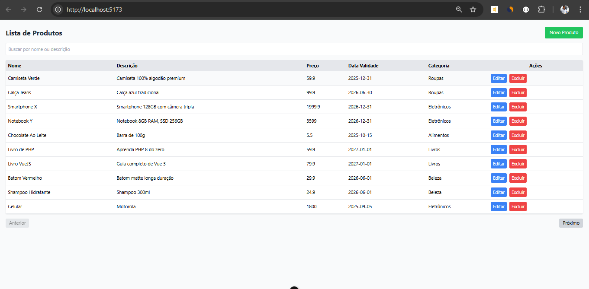
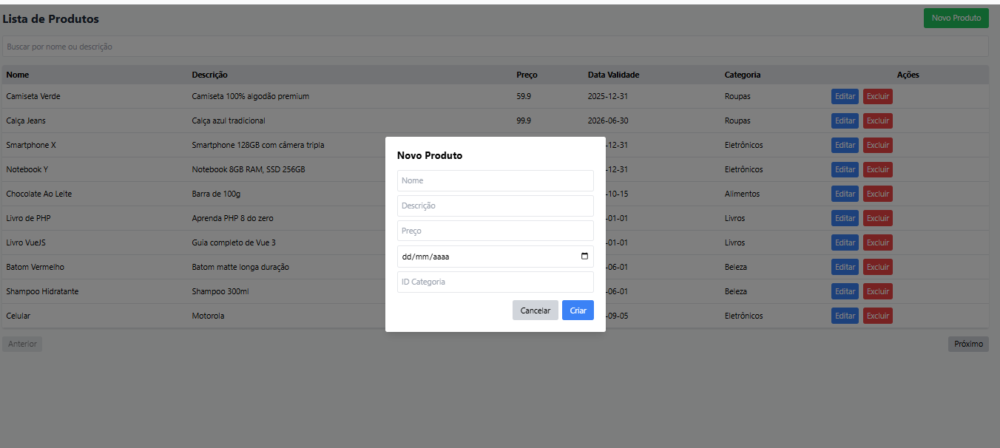
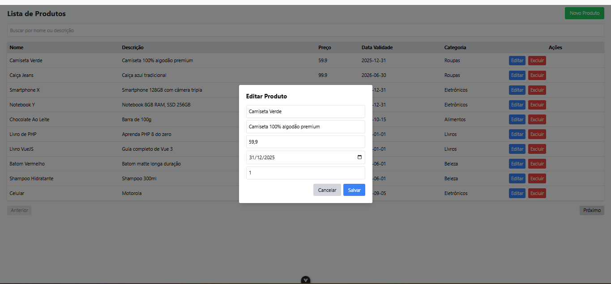

# Projeto Laravel + Vue.js - Lista de Produtos


Este projeto é uma aplicação de gerenciamento de produtos, construída com **Laravel** no backend (API) e **Vue.js + Tailwind CSS** no frontend.  

O avaliador pode testar o projeto rapidamente usando o **banco de dados real** que configurei, sem precisar instalar ou configurar MySQL localmente. O frontend também pode ser aberto diretamente via navegador, sem necessidade de build, graças ao uso do **Tailwind CSS via CDN**.

---

## Tecnologias utilizadas

- **Backend:** Laravel 10  
- **Frontend:** Vue.js + Tailwind CSS (via CDN)  
- **Banco de dados:** MySQL real (para facilitar testes)  
- **Outros:** Composer, PHP 8+, Node.js (opcional para Vue)  

---

## Por que Tailwind CSS?

Escolhi **Tailwind CSS** por facilidade de uso e rapidez na prototipação via CDN. Já trabalhei com **Bootstrap** e posso me adaptar a outros frameworks de CSS sem problemas.

---

## Conexão com o banco de dados

O Laravel está conectado a um **banco de dados MySQL real**, hospedado online apenas para este projeto. Isso permite que o avaliador teste a aplicação sem precisar configurar MySQL local.  

Se desejar, posso fornecer instruções para conectar a um banco de dados local para testes offline.

---

## Autenticação

Não há autenticação de rotas API neste projeto (não utilizei **Sanctum** ou **JWT**), para simplificar a avaliação.  
Tenho experiência em autenticação no Laravel e posso integrar rapidamente se for necessário.

---

## Estrutura do projeto
projeto/
│
├─ backend_api/ ← Laravel API
├─ frontend/ ← Vue.js + Tailwind (index.html)
├─ .gitignore
├─ README.md


### 1. Backend (Laravel API)

1. Entre na pasta `backend_api`:
   ```bash
   cd backend_api

2. Instale as dependências do Laravel:
composer install
cp .env.example .env
php artisan key:generate

3. Rode a aplicação:
php artisan serve

### 2. Frontend (Vue.js + Tailwind)
Abra a pasta frontend: 
cd frontend
Basta abrir o arquivo index.html em qualquer navegador ou 
npm run dev 

### 3. Testando

Com o backend rodando (http://127.0.0.1:8000) e o frontend aberto no navegador, você poderá:

Visualizar a lista de produtos
Adicionar, editar e excluir produtos via interface
Testar as requisições diretamente no navegador (Vue faz chamadas à API Laravel)

Prints da Aplicação:
## LISTA DE PRODUTOS {PESQISA | PAGINAÇÃO | BOTÕES EDITAR-EXCLUIR-CRIAR}


## CRIAR PRODUTO


## EDITAR PRODUTO


## EXCLUIR PRODUTO


### CONSIDERAÇÕES FINAIS 
Fico muito feliz com a oportunidade de participar do processo. Sei que o projeto poderia ser aprimorado em alguns pontos, como a implementação de autenticação e o uso do Docker para facilitar a visualização, mas tenho facilidade em aprender rapidamente esses detalhes e em entregar soluções mais robustas.

Recentemente, desenvolvi um sistema de controle de almoxarifado para uma empresa. Apesar de não ter utilizado Laravel como API, utilizei PHP puro com hash de senhas, autenticação via token nas rotas e gerenciamento de usuários. Para o frontend, usei Tailwind CSS, HTML e CSS, e o resultado ficou bastante funcional e intuitivo.

# Agradeço muito pela oportunidade e estou empolgado com tudo o que está por vir!

Caso tenham interesse em ver e testar esse sistema, segue o link:

https://sistema-conipa.vercel.app/ 

login como usuario: 
RE: 25 
SENHA: Usuario25#

login como administrador 
RE: 1
SENHA: god 
# innyx_pr
